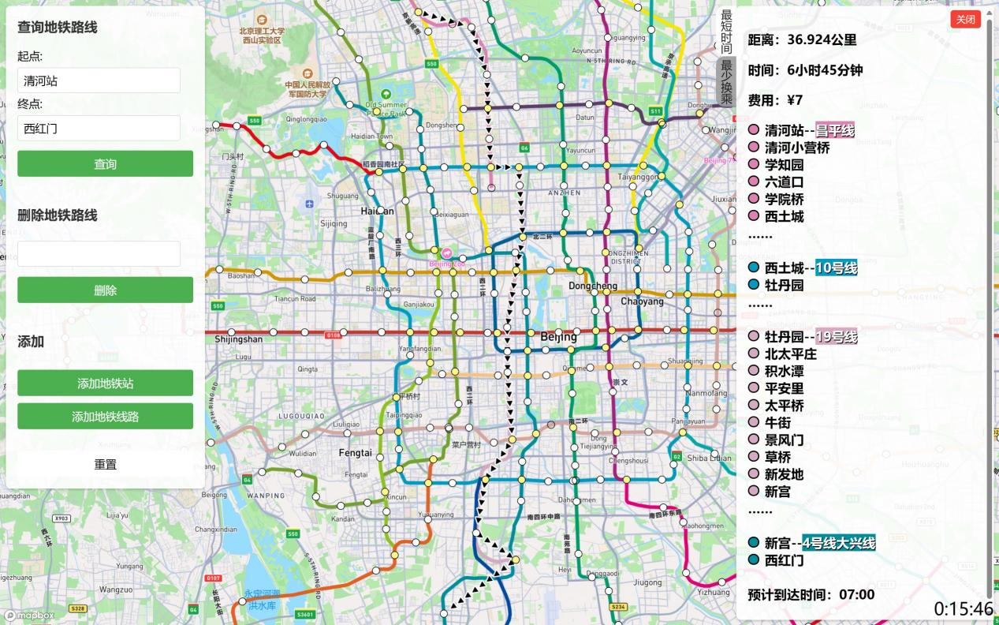
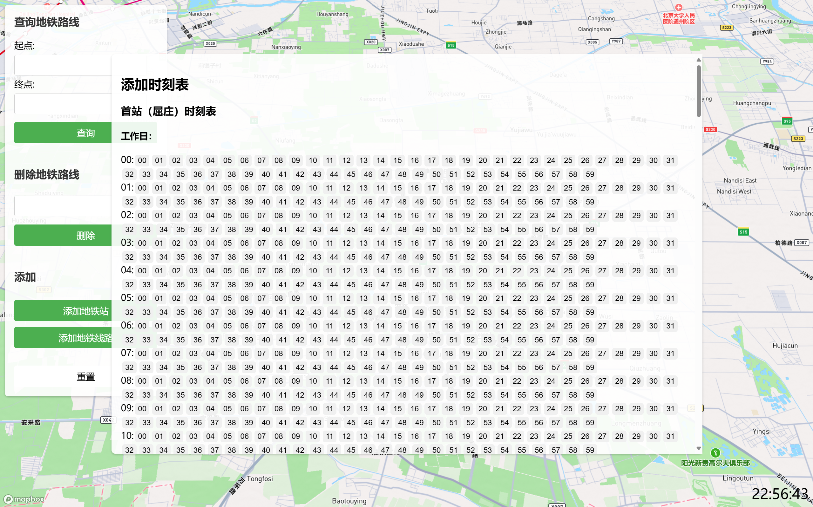

# 快速开始：
用浏览器（Edge、Google等）打开BJsubway.html文件。（运行时卡住可能是网络波动，可通过浏览器的控制面板查看，刷新或科学用网即可解决）

说明：
1. BJsubway.html没有完整的注释，为 source_code的整合版，以便用户可以直接在本地运行。（不用部署到服务器，通过网站访问）
2. 查看源代码请通过 source_code，有详细注释。
3. data_processing文件里包含了我处理出地铁基本信息所使用的代码和数据。
  
注意：本程序运行需要消耗mapboxgl.accessToken（BJsubway.html第461行），该Token目前可以运行但有限额，建议用户使用自己的。

具体使用方法见实验报告中的用户使用说明

# 数据结构课程设计报告

## 一、实验题目

### （一）问题描述
当一个用户从甲地到乙地时，由于不同需求，就有不同的交通路线，有人希望以最短时间到达，有人希望用最少的换乘次数等。请编写一北京地铁线路查询系统，通过输入起始站、终点站，为用户提供两种决策的交通咨询。

### （二）设计要求
1. 提供对地铁线路进行编辑的功能，要求可以添加或删除线路。
2. 提供两种决策：最短时间，最少换乘次数。
3. 中途换乘站换乘耗时为5分钟，地铁在除始发站外每一站停留1分钟。
4. 按照始发站时间、地铁时速及停留时间推算之后各个线路的地铁到站时间。
5. 该系统以人机对话方式进行。系统自动获取当前时间，用户输入起始站，终点站以及需求原则（需求原则包括最短时间，最少换乘次数），系统输出乘车方案：乘几号线，距离，时间，费用，换乘方法等相关信息。

## 二、题目分析与算法设计

### （一）题目分析
#### 1. 需求分析：
- 用户需求多样：用户可能根据不同的需求选择最短时间或最少换乘次数的路线。
- 动态输入：用户会输入起始站和终点站，并选择优化目标（最短时间或最少换乘次数）。

#### 2. 功能需求：
- 地铁线路编辑：系统需允许用户添加或删除地铁线路，以适应地铁网络的变化。
- 路线决策：系统需要提供两种决策支持——最短时间到达和最少换乘次数。
- 换乘考虑：在计算路线时，考虑换乘站换乘耗时（5分钟）以及地铁在每站的停留时间（1分钟）。
- 实时计算：系统需根据当前时间和地铁时速计算出地铁的到站时间。

#### 3. 交互需求：
- 系统应具备友好的人机对话界面，用户通过该界面进行所有交互。
- 输出信息需包括乘车方案的详细信息，如乘坐哪一号线，整体行驶距离，预计耗时，票价费用及换乘方案等。

### （二）算法设计

#### 1. 数据结构选择

##### （1）PriorityQueue 类
实现了一个基于数组的最小堆结构，用于维护一个优先队列，其中元素按特定的优先级（t）排序。

- **constructor()**（构造函数）：初始化一个空的数组 `this.heap`。这个数组将用来存储堆的所有元素，即队列中的所有站点对象。
- **enqueue(value)**（添加元素）：将新元素 `value` 添加到数组 `this.heap` 的末尾。调用 `bubbleUp()` 方法，该方法负责调整堆结构，确保插入新元素后堆的性质（父节点的值总是小于子节点的值）仍然得以保持。
- **bubbleUp()**（向上调整）：从数组的最后一个位置（新加入的元素的位置）开始。比较当前元素与其父节点的值：如果当前元素的值小于父节点的值，则交换这两个元素。更新当前元素的位置到父节点的位置，继续向上比较直到根节点或直到不需要交换为止。
- **dequeue()**：如果堆中只有一个元素，直接移除并返回这个元素。移除并返回堆顶元素（数组的第一个元素），这是当前优先级最高（值最小）的元素。将堆中最后一个元素移动到堆顶（数组的第一个位置）。调用 `sinkDown()` 方法从新的堆顶开始向下调整堆结构，确保堆的性质维持正确。
- **sinkDown(index)**（向下调整）：从指定的 `index` 开始，计算左右子节点的索引。比较当前节点的值与其左右子节点的值，找出三者中最小的。如果最小值不是当前节点的值，则与最小值的节点交换位置。更新当前节点的位置到交换后的位置，继续向下比较直到叶节点或直到不需要交换为止。
- **peek()**（查看堆顶元素）：返回数组的第一个元素（堆顶元素），即当前优先级最高的元素。如果堆为空，则返回 `null`。
- **isEmpty()**（检查堆是否为空）：检查数组 `this.heap` 的长度是否为0。如果长度为0，则队列为空；否则，队列中有元素。

##### （2）station 类
代表地铁系统中的一个站点，存储站点相关信息并用于路径计算。

- **name**：站点名称。
- **t**：用于排序的权重。
- **d**：从起点到当前站点的距离（单位：米）。
- **time**：从起点到当前站点的时间（单位：秒）。
- **ld**：当前站点的线路和方向信息。
- **list**：用于存储路径信息的对象。
- **cnt**：累计换乘次数。
- **pre**：前一个站点的引用，用于路径回溯。

##### （3）对象 g
JSON 对象，由函数 `initial()` 赋予初始值，储存关于地铁的基础信息。

- **tjson**：储存每个地铁站的时间表。获取这个小时发车时刻的方式为 `g.tjson[地铁站名称][地铁线路名称][方向（1/2）][工作日/双休日][0~23]`。
- **sjson**：储存每个地铁站的基本信息，即所在线路、与其联通的线路个数、edge 数组。edge 储存与其相连的站点名称、线路、距离（单位：米）、速度（单位：公里/小时）、时间（单位：秒）、方向（1/2）。
- **point**：储存每个地铁站的地图图层数据。
- **station**：储存现有的每个地铁站的名称。
- **mp**：储存每个地铁站全称对应的简称。
- **mp_in**：储存每个地铁站简称对应的全称。
- **line**：储存现有的每个地铁线路的名称。
- **color**：储存每个地铁线路对应的颜色。

##### （4）对象 geoPath
GeoJSON 对象，用于存储地理路径数据。

#### 2. 主要函数

| 函数名称 | 参数 | 返回值 | 功能 |
| --- | --- | --- | --- |
| **time_wait** | name (String): 地铁站点的名称 line (String): 地铁的线路 direction (String): 地铁的运行方向 _t (Number):从当前时刻起考虑的额外等待时间（单位：分钟） g (Object): 包含地铁基本信息的对象 | Number: 返回从当前时间起到下一班地铁到来的等待时间（分钟）。如果在24小时内找不到合适的班次，则返回 -1 表示错误。 | 计算特定地铁站在指定线路和方向上的下一班地铁的等待时间。 |
| **dijkstra_time** | start (String): 起始站点的名称 end (String): 目的站点的名称 g (Object): 包含地铁基本信息的对象 | Object \| Number: 如果找到从起始站到目的站的路径，则返回一个对象，包括路线的详细列表、总距离、总时间和换乘次数。如果无法到达或参数错误，返回 0 或 -1,分别表示“地铁站名称不正确”和“无法通过地铁到达”。 | 使用基于优先队列的 Dijkstra 算法寻找从一个地铁站到另一个地铁站的最短用时路径。 |
| **dijkstra_cnt** | start (String): 路径搜索的起始站点名称 end (String): 路径搜索的终点站点名称 g (Object): 包含地铁基本信息的对象 | Object \| Number: 如果找到从起始站到目的站的路径，则返回一个对象，包括路线的详细列表、总距离、总时间和换乘次数。如果无法到达或参数错误，返回 0 或 -1,分别表示“地铁站名称不正确”和“无法通过地铁到达”。 | 使用基于优先队列的 Dijkstra 算法寻找从一个地铁站到另一个地铁站的最少换乘次数路径。 |
| **initial** | 无 | Object：包含初始的地铁基本信息的对象。 | 初始化地铁基本信息 |
| **无（监听查询路径表单提交事件）** | event: 事件对象，包含关于触发事件的详细信息 | 无 | 调用 dijkstra_time 和 dijkstra_cnt 函数计算最短时间路径和最少换乘路径。出现错误通过弹窗告知用户。如果路径计算成功，显示结果容器，并在网页上展示计算得到的路径。 |
| **无（监听最短时间按钮的点击事件）** | 无 | 无 | 设置最短时间按钮为选中状态，移除最少换乘按钮的选中状态。显示最短时间路径的详细信息。 |
| **无（监听最少换乘按钮的点击事件）** | 无 | 无 | 设置最少换乘按钮为选中状态，移除最短时间按钮的选中状态。显示最少换乘路径的详细信息。 |
| **add_path** | start（String）： 表示起点站的名称 end（String）：表示终点站的名称 | 无 | 用于在地图上添加一条从起点到终点的路径。 |
| **update_path** | 无 | 无 | 用于更新地图上的路径表示并调整视角以确保新路径可见。 |
| **calculateBounds** | geojson(Object): 包含地图图层的信息 | [[minLng, minLat], [maxLng, maxLat]]：西南角的经纬度和东北角的经纬度 | 用于计算路径数据的地理边界。 |
| **toHtml** | res(Object): 路径信息包括路线的详细列表、总距离、总时间和换乘次数 | html（String）：HTML字符串 | 根据路径查询结果生成路径图层和 HTML 内容用于展示。 |
| **无（监听删除地铁线路表单提交事件）** | event: 事件对象，包含关于触发事件的详细信息 | 无 | 用于处理地铁线路的删除操作，并更新图层数据。 |
| **无（监听添加地铁站按钮的点击事件）** | 无 | 无 | 显示提示对话框，并设置地图上的一次性右键事件监听器。 |
| **handleRightClick** | e(Object): 包含了关于右键点击事件的所有数据 | 无 | 捕获点击位置的经纬度，并显示用于添加地铁站的界面。 |
| **无（监听添加地铁站表单的提交事件）** | event: 事件对象，包含关于触发事件的详细信息 | 无 | 添加新的地铁站到系统中，并更新相关地图显示 |
| **无（监听添加地铁线路按钮的点击事件）** | 无 | 无 | 显示一个用于输入新地铁线路详细信息的表单。 |
| **无（监听添加地铁线路表单提交事件）** | 无 | 无 | 用于处理地铁线路的添加，包括验证输入、更新数据结构和视觉元素，并显示一个用于获取首末站时间表的表单。 |
| **无（监听站点数量输入框 change 事件）** | 无 | 无 | 首先清空站点输入框容器，根据输入框中的站点数量动态生成新的站点输入框，并为其配置必要的属性和样式。 |
| **无（监听时刻表的表单提交事件）** | 无 | 无 | 更新时刻表信息，清除选中状态，并隐藏添加时刻表的窗口。 |
| **create_time** | f（String）: 站点名称 k（String\|Number）: 方向（1/2） | 无 | 用于为指定站点创建一个新的时间表结构，该结构用于存储和管理地铁的发车时间。 |
| **updata_time1** | f（String）: 站点名称 k（String\|Number）: 方向（1/2） | 无 | 更新首站的指定线路和方向的时间表，包括工作日和双休日的发车时间。 |
| **update_time2** | f（String）: 站点名称 k（String\|Number）: 方向（1/2） | 无 | 更新末站的指定线路和方向的时间表，包括工作日和双休日的发车时间。 |
| **updata** | n（String）：源站点 to（String）：目标站点 k（String\|Number）: 方向（1/2） time（Number）：时间间隔 | 无 | 用于更新地铁时刻表，它将计算从源站点到目标站点的到达时间，并将这些时间添加到目标站点的时刻表中。 |
| **无（监听重置按钮的点击事件）** | 无 | 无 | 重置应用的状态到初始配置，并更新界面元素以反映这些更改。 |

#### 3. 主要函数调用关系
##### （1）查询地铁路线
1.触发查询路径表单提交事件，调用dijkstra_time和dijkstra_cnt函数获取路径基本信息，调用toHtml函数根据路径查询结果生成路径图层和HTML内容用于展示。
2.dijkstra_time调用time_wait函数辅助计算等车时间
3.dijkstra_cnt调用time_wait函数辅助计算等车时间
4.toHtml调用add_path更新地理路径，调用updata_path更新地图上的路径表示并调整视角以确保新路径可见。
5.updata_path调用calculateBounds函数用于计算路径数据的地理边界。
##### （2）删除地铁线路
触发删除地铁线路表单提交事件，删除该线路，并更新图层数据。
##### （3）添加地铁站
1.触发添加地铁站按钮的点击事件，显示提示对话框，并设置地图上的一次性右键事件监听器，调用handleRightClick函数，捕获点击位置的经纬度，并显示用于添加地铁站的界面。
2.触发添加地铁站表单的提交事件，添加新的地铁站到系统中，并更新相关地图显示
##### （4）添加地铁线路
1.触发添加地铁线路按钮的点击事件，显示一个用于输入新地铁线路详细信息的表单。
2.触发添加地铁站表单的提交事件，显示一个用于获取首末站时间表的表单。
3.触发站点数量输入框change事件，动态生成新的站点输入框。
4.触发时刻表的表单提交事件，调用updata_time1更新首站的指定线路和方向的时间表，调用update_time2更新末站的指定线路和方向的时间表，调用create_time为指定站点创建一个新的时间表结构，调用updata更新地铁时刻表，它将计算从源站点到目标站点的到达时间，并将这些时间添加到目标站点的时刻表中。
5.updata_time1调用create_time为指定站点创建一个新的时间表结构。
6.updata_time2调用create_time为指定站点创建一个新的时间表结构。
##### （5）重置
触发重置按钮的点击事件，调用initial初始化地铁基本信息。
#### 4.主要算法实现：
##### （1）最短时间算法（Dijkstra 算法）
###### a.初始化
首先，函数 dijkstra_time(start, end, g) 从全局图对象 g 中获取站点信息，初始化一个 PriorityQueue 实例用于处理待探索站点。
###### b.处理起始站点
算法遍历起始站点 start 的所有邻接边，对于每一条边：
- 提取邻接站点的名称、所在线路、花费时间和距离。
- 调用 time_wait() 函数计算在起始站等待下一班车的时间。
- 检查该线路是否在允许的线路列表中。如果不在，则跳过此边。
- 创建起始站点的状态对象，并初始化邻接站点的状态对象，然后将其添加到优先队列中。
###### c.主循环处理
当优先队列不为空时，算法继续执行以下操作：
- 从优先队列中取出具有最短时间（优先级最高）的站点 v。
- 如果此站点是终点站 end，则结束循环。
- 否则，遍历该站点 v 的所有邻接边，并对每个邻接站点进行处理：
  - 检查该站点是否已经被访问过，如果是，则跳过。
  - 如果邻接站点与当前站点在同一线路和方向上，直接更新状态并添加到优先队列。
  - 如果不在同一线路或方向，计算在此站换乘后的等待时间，再创建新的状态对象，考虑换乘成本，然后将其添加到优先队列。
###### d.构建结果
当从优先队列中取出的站点是终点站时，算法将停止，并开始构建结果对象：
- 逆向遍历从起始站到终点站的路径，使用每个站点的前驱引用。
- 记录路径中的每一站，以及累计的总距离、总时间和换乘次数。
###### e.返回结果
返回一个包含完整路线信息、总距离、总用时和总换乘次数的结果对象。如果没有找到到达终点站的路径，返回 -1 表示无法到达。
##### （2）最少换乘算法（Dijkstra 算法）
除了“c.主循环处理”中换乘时间的权值由5变为了5e5，其他过程与最短时间算法相同。
## 三、程序复杂度分析
声明：n为地铁站的节点数，m为边数。
### （一）时间复杂度
#### 1.重置
与初始化时间复杂度相同，时间复杂度取决于g的数据规模，对象g中通过类似邻接表的方式储存着每个边的信息，g的规模与n+2*m成正比。时间复杂度为O（n+m）。
#### 2.查询地铁路线
查询路径时，计算等车时间的时间复杂度与其时间表有关，与n，m无关是常数级的时间复杂度。计算路径用了堆优化的迪杰斯特拉算法，每次主循环都可以确定一条由起点到一个新站的最短路径，所以最多循环n次；优先队列中放置的是站点信息，入队和出队的最坏时间复杂度为O(long(n))，则最坏情况下循环n次，出队n次，入队m次，时间复杂度为O（（n+m）long(n)）。

打印路径并显示在图像中的时间复杂度与路径长度相关，最坏情况下路径长度为n，即时间复杂度为O（n）。
#### 3.删除地铁线路
删除线路，线路数量为常数级，时间复杂度取决于更新每个站的线路信息。最坏情况下时间复杂度为O（n）。
#### 4.添加地铁站
添加的时间复杂度为O（1），检验名称是否重复的时间复杂度为O （n）。
#### 5.添加地铁线路
添加地铁线路的时间复杂度与输入的站点规模有关，最坏情况下时间复杂度为O（n）。
#### 6.总结
本代码的时间复杂度为O（（n+m）long(n)）。

### （二）空间复杂度分析
#### 1.重置
与初始化空间复杂度相同，空间复杂度取决于g。对象g中通过类似邻接表的方式储存着每个边的信息，g的空间复杂度为O（n+m）。
#### 2.查询地铁路线
查询路径时，空间复杂度取决于队列的长度，最坏情况下空间复杂度O（n）。

打印路径并显示在图像中的空间复杂度与路径长度相关，最坏情况下空间复杂度为O（n）。
#### 3.删除地铁线路
删除线路，是对原有数据的修改，会影响m的大小。
#### 4.添加地铁站
添加地铁站，是对原有数据的修改，会影响n的大小。
#### 5.添加地铁线路
添加线路，是对原有数据的修改，会影响m的大小。
#### 6.总结
本代码的空间复杂度为O（n+m）。

## 四、程序运行的示例执行结果及测试情况说明
### （一）示例执行结果
#### 1.初始状态

初始状态地图的中心在（[116.3848, 39.9042]），点击站点可以获得站点的具体信息。左边是控制栏，右下角是获取的本地时间。

#### 2.查询地铁路线
说明：因为查询的时候错过了末班车，所以只能明早到达。
##### （1）最短时间：
（清河站——>西红门）

##### （2）最少换乘：
（清河站——>西红门）

#### 3.删除地铁线路
删除10号线：

说明：没有地铁线路通过的站点为透明的

#### 4.添加地铁站
添加“采育”地铁站：

#### 5.添加地铁线路
添加“廊坊线”：

添加时间表：

成功添加：

说明：根据当前时间所乘坐的车是1：59发车

#### 6.重置
使地图飞行到指定的视角，并初始化所有信息

### （二）错误情况说明
出现错误，窗口会出现这样的弹窗：

#### 1.查询地铁路线
##### （1）起点与终点相同

##### （2）名称错误

##### （3）不连通

#### 2.删除地铁线路
##### （1）名称错误

#### 3.添加地铁站
##### （1）名称重复

#### 4.添加地铁线路
##### （1）名称重复（即便该名称的地铁线路已删除也不能使用）

##### （2）名称错误

#### 5.输入框错误
##### （1）未输入内容

##### （2）输入类型错误

## 五、用户使用手册
### （一）运行方法
用浏览器（Edge、Google等）打开BJsubway.html文件，建议全屏使用。（运行时卡住可能是网络波动，可通过浏览器的控制面板查看，刷新或科学用网即可解决）
注意：本程序运行需要消耗mapboxgl.accessToken（BJsubway.html第461行），该Token可以运行，建议用户使用自己的。

### （二）使用说明
#### 1.初始状态
初始状态地图的中心在北京，俯仰角为40度，点击站点可以获得站点的具体信息。左边是控制栏，右下角是获取的本地时间。

#### 2.查询地铁路线
##### （1）在起点输入框输入正确的地铁站名称，可以通过检索栏获得。

##### （2）在终点输入框输入正确的地铁站名称，与起点的不同。（车道沟——>金台夕照）

##### （3）点击“查询”按钮即可在右边的显示框获得起点到终点的最短时间路径，且视角会调整到路径的正上方，并在地图上展示路径。（车道沟——>金台夕照）

##### （4）点击“最少换乘”按钮即可获取最少换乘路径的相关信息。（车道沟——>金台夕照）

##### （5）点击“关闭”按钮，隐藏路径和右边的显示框。

#### 3.删除地铁线路

##### （1）在输入框输入正确的地铁线路名称，可以通过检索栏获得。

##### （2）点击“删除”按钮，出现“已删除……”提示框。

##### （3）点击“确定”按钮，成功删除线路，没有线路通过或建设中的站点会变为透明的。

#### 4.添加地铁站
##### （1）点击“添加地铁站”按钮，出现“右键地图添加站点”的弹窗。

##### （2）点击“确定”按钮，在地图上右键需要添加地铁站的位置，出现输入地铁站名称的对话框。

##### （3）输入与其他地铁站名称不同的名字。

##### （4）点击“确定”按钮，成功添加站点。

#### 5.添加地铁线路
##### （1）点击“添加地铁线路”按钮，出现添加地铁线路的对话框。

##### （2）输入内容，对话框会根据站点数量动态出现需要填写的站点信息的输入框。

##### （3）输入内容，站点信息、输入的类型应正确。

##### （4）点击“确定”按钮，出现选择首末站工作日和双休日时间表的对话框。

##### （5）选择正确的时间。

##### （6）点击“确定”按钮成功添加线路。

查询路径：

#### 6.重置
点击“重置”按钮，地图、视角和数据恢复初始值，输入框内信息不变，除左边的控制栏外，所有对话框隐藏。

### （三）文件说明
1. BJsubway.html没有完整的注释，为 source_code的整合版，以便用户可以直接在本地运行。（不用部署到服务器，通过网站访问）
2. 查看源代码请通过 source_code，有详细注释。
3. data_processing文件里包含了我处理出地铁基本信息所使用的代码和数据，仅作展示没有详细注释和运行方法。
